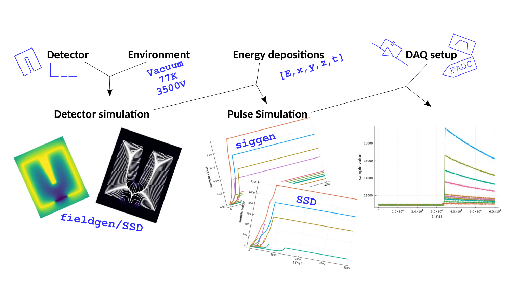
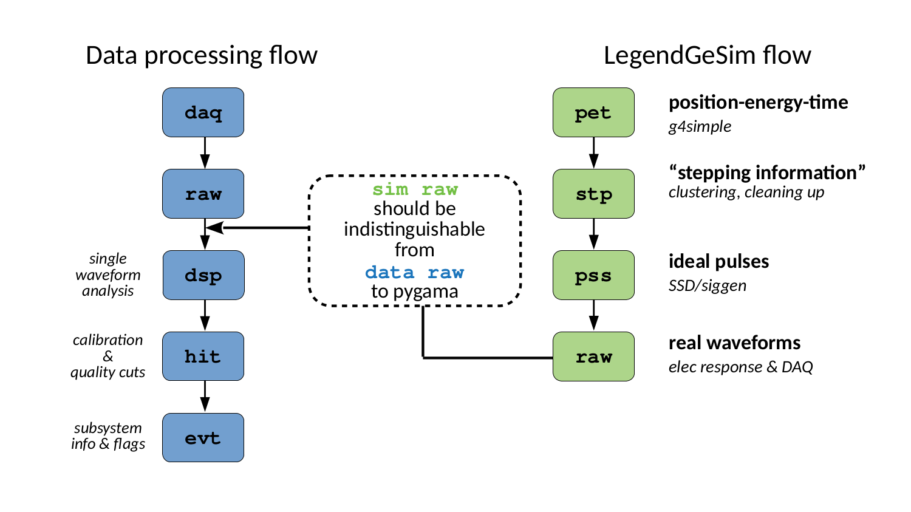

# The LEGEND Germanium Simulation Chain

LegendGeSim is a multi-purpose tool that can be used for anything from visualizing detector geometry to simulating `raw` files with realistic data-like waveforms that mimic data and are compatible with data processing tools.

The path towards a data-like `raw` hdf5 file starts from simulating the detector itself for given geometry and environmental conditions; then simulating pulses based on given information on energy depositions; and finally, simulating the effects of the DAQ chain.

The chain can be used for any step in this path independently: visualize detector geometry, simulate fields, simulate ideal pulses, or finally, simulate realistic data-like waveforms. Each step is described in a corresponding Manual and Tutorial section.

The tiers of the simulation are `pet->stp->pss->raw` where
- `pet` tier: input information on `p`osition, `e`nergy amd `t`ime of the depositions
- `stp` tier: stepping information, currently clustering, removing events reconstructed outside of the detector and with zero energy. In the future things like pile-up may go here
- `pss` tier: ideal pulses simulated by `SolidStateDetectors` or `siggen`
- `raw` tier: simulated realistic waveforms in hdf5 format that mimics data `raw` tier

